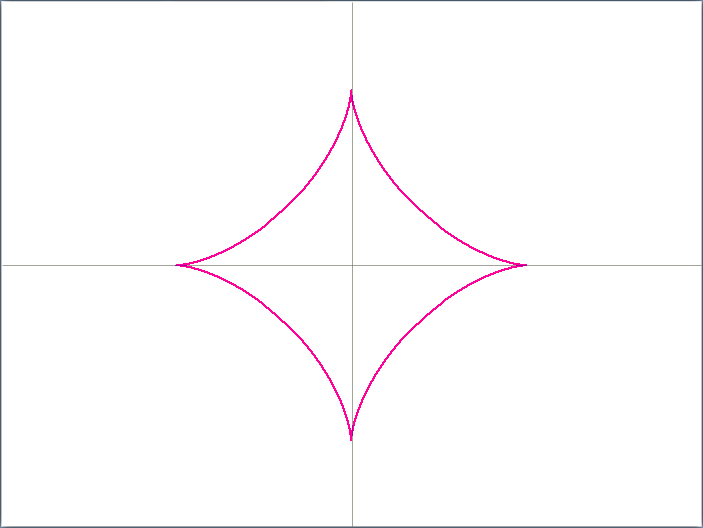
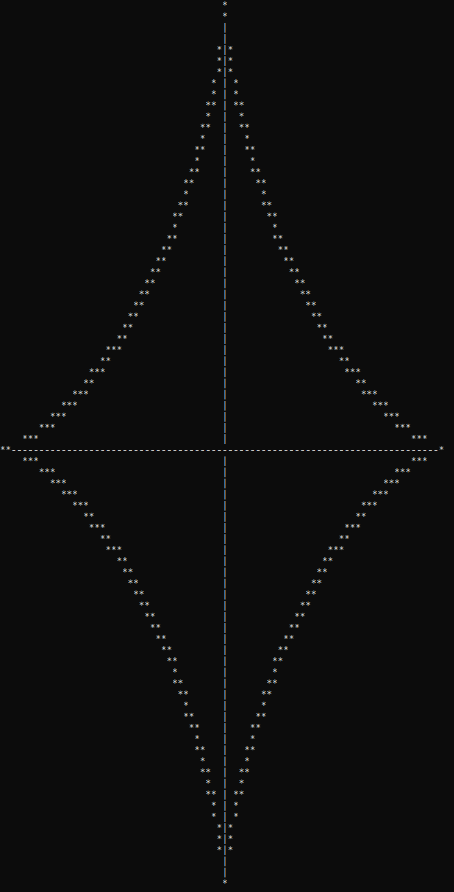

# Astroid
Curve studied by Rømer in 1674, Jean Bernoulli in 1691, Leibniz in 1715 and D'Alembert in 1748.
Named by Littrow in 1838.

"Astroid" comes from the Greek word "star" : "astron" (like the word "asteroid" designing star like objects).

Other names : H4 (hypocycloid with 4 cusps), cubocycloid.

## Draw an Astroid in the console
Optional arguments:
- a (double)
- ε (double)

What we expect:

Example output:

